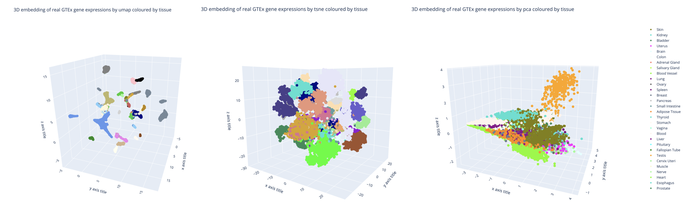
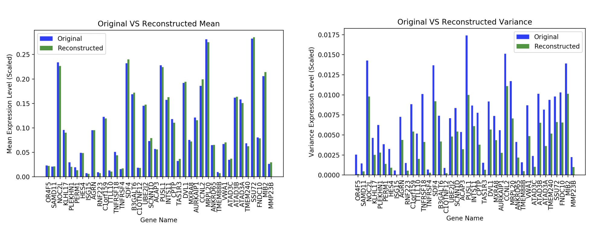
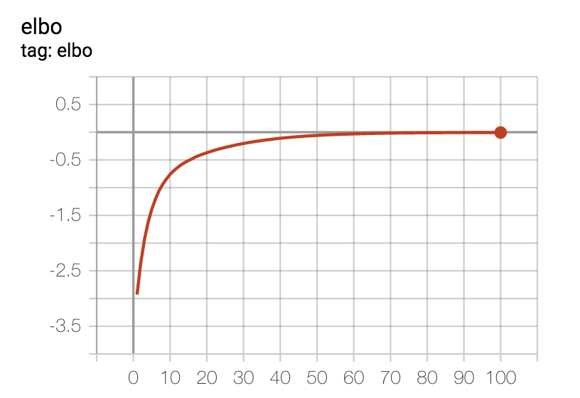
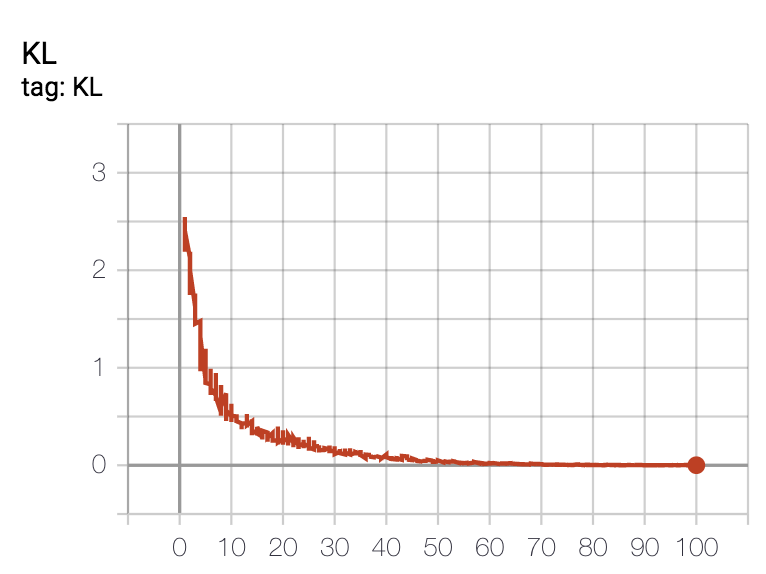

### Conditional Variational Auto-Encoder for GTEx dataset (V8)   

This project aims to generate synthetic gene expression data using generative models.  
We first investigate the 3D representation of the data and possible variables to condition on in order to effectively separate the samples and distributions. Currently model is conditioned on tissue.

3D Representations (UMAP, TSNE, PCA) of the GTEx dataset (1000 random genes) coloured by tissue:

Current reconstruction quality for CVAE, conditional on tissue.

Based on:
1. https://www.tensorflow.org/tutorials/generative/cvae
2. https://github.com/greenelab/tybalt
3. https://arxiv.org/pdf/1908.06278.pdf
4. https://github.com/timbmg/VAE-CVAE-MNIST
5. https://gtexportal.org/home/
6. Papers on loss of variance for VAE: https://arxiv.org/pdf/2002.09860.pdf,
 https://arxiv.org/pdf/2002.07514.pdf,
 https://github.com/asperti/BalancingVAE/blob/master/computed_gamma.py

Progress of the project:
- [x] Baseline model creation
- [x] Functions for evaluating mean, absolute difference and grouping in the latent space
- [ ] Model tuning 
   * latent space size
   * batch size, learning rate (epochs number should be determined with early stopping)
   * number of additional dense layers, number of neurons in each additional layer
- [x] Conditional VAE model (one of conditions: tissue or age)
- [ ] b-VAE model (MSE / KL-divergence weight in the loss function)
- [ ] Correlated VAE (https://arxiv.org/pdf/1905.05335.pdf)

- `torch_model.py ` - Layers and properties of the neural network
- `gtex_loder.py` - Loading gene expression dataset
- `torch_training.py` - Model training and testing

`python3 torch_training.py` to start the generation algorithm

`tensorboard --logdir logs/run{number_of_run}` to start tensorboard

Snapshots of TensorBoard scalars:

`ELBO` from epoch 1 to n_epochs

`KL Divergence (latent loss)` from epoch 1 to n_epochs

`MSE (reconstruction loss)` from epoch 1 to n_epochs

